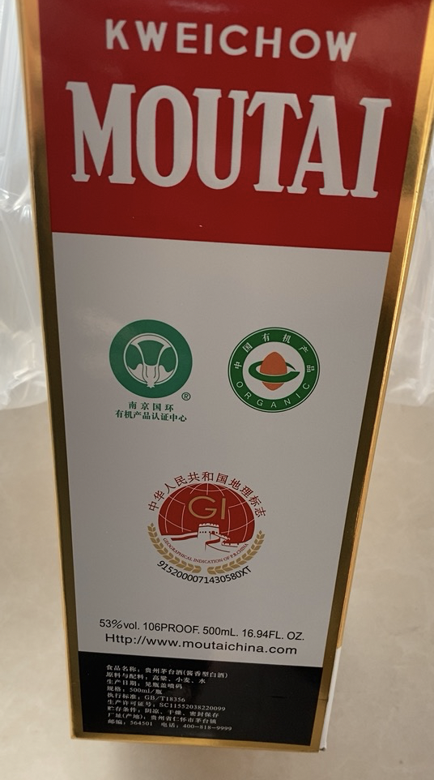

# seckiller

> 苏宁/京东/天猫秒杀器。

### 镇楼图

### 原理

经过验证，抢茅台难度：天猫 > 京东 > 苏宁易购。

- 苏宁易购，一定概率会收到前方拥挤拦截窗，不过绕过去就能加大获胜概率。
- 京东，根据 `GitHub` 流行源码，直接怼接口就行，（未来）存在被封杀、被风控成黑户的可能。
- 天猫，下单接口加密，很难逆向破解，建议在 `Windows` 系统下（性能网络要好，账号没被风控），监控天猫网页版购物车，走多开、到点找图和模拟点击，一定概率能抢到。

### 源码

> 暂不放出，先自用。

